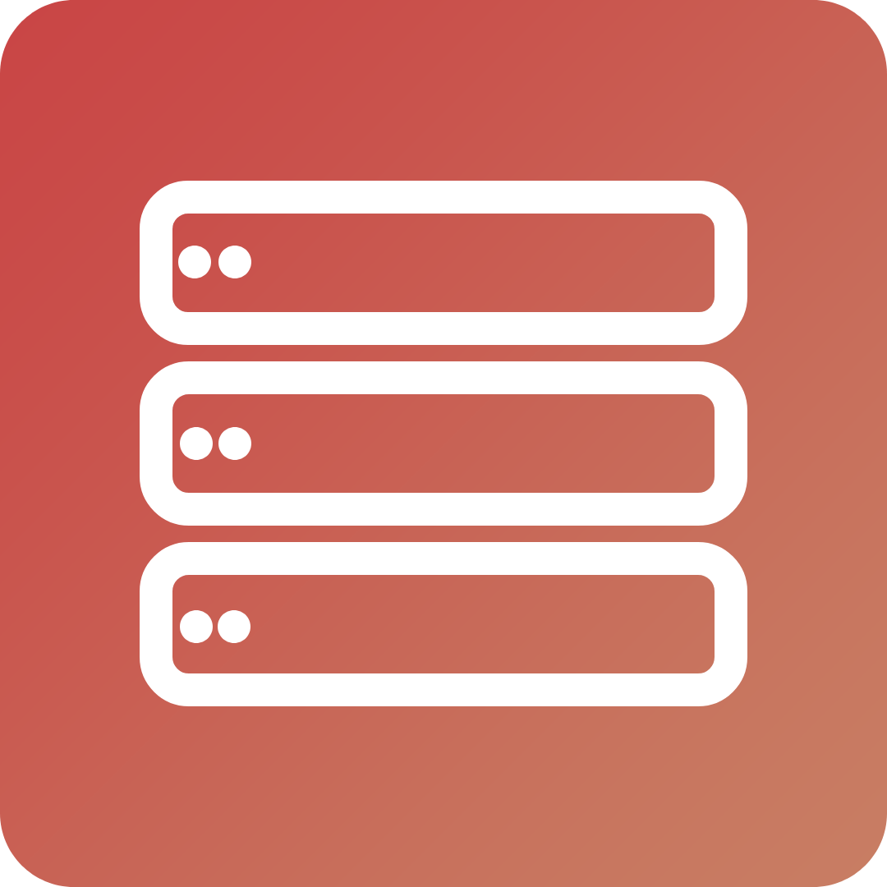

# Cesium

Cesium is a performance focused mod for Minecraft that seeks to improve 
the ram usage of the minecraft server. It does this by saving the chunks in
memory to the disk after a certain amount of time has passed without any
activity in the chunk. This allows the server to run with a smaller amount of
ram, and can be useful for servers that have a large amount of chunks loaded.

## Inspiration

This mod was inspired by the famous 
[Sodium](https://github.com/CaffeineMC/sodium/) mod from 
[CaffeineMC](https://github.com/CaffeineMC).

## Installation

This is a fabric mod, so you will need to install the fabric loader and the 
fabric api. You can download the latest version of the mod from the releases
page on github.

## Building from source

To build the mod from source, you will need to have the JDK installed on your
computer. You can then run the following command to build the mod:

```shell
./gradlew build
```

The mod will be built in the `build/libs` directory.

## License

This mod is licensed under the MIT license. You can find the full license in
the `LICENSE.txt` file.

## Contributing

If you would like to contribute to the mod, you can fork the repository and
submit a pull request. Please make sure to follow the code style of the project
and to test your changes before submitting a pull request.
